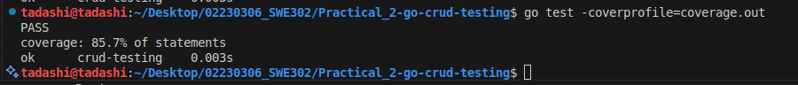
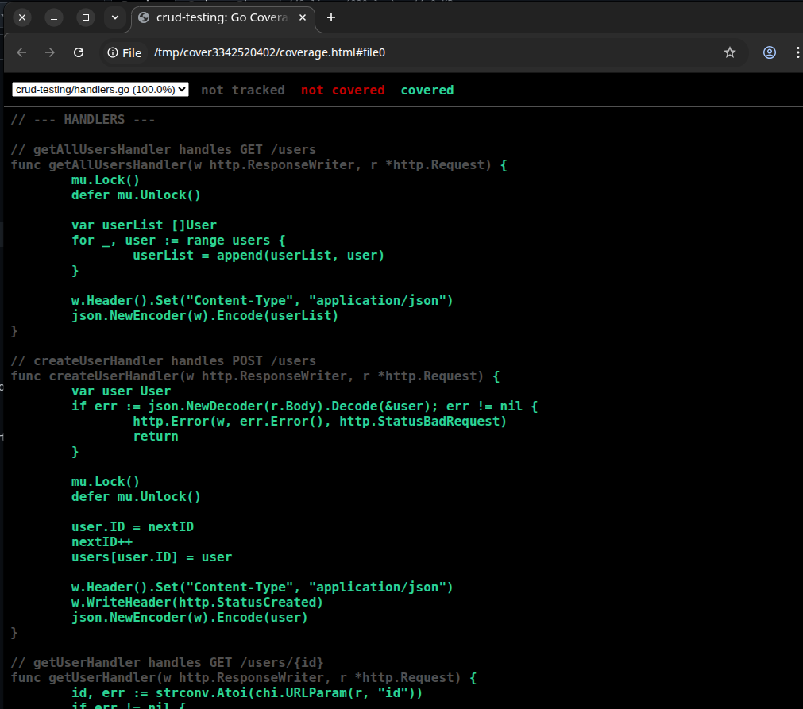

# Practical 2 Test Summary

##  Executive Summary

This documentation is a testing the RESTful CRUD API server built in Go. It demonstrates proficiency in writing comprehensive unit tests, measuring code coverage, and ensuring software quality through systematic testing methodologies. The final test suite achieved 85.7% code coverage across all handlers, with 8 distinct test cases covering various scenarios including success paths, error handling, and edge cases.

# Testing Methodology

## Test 1: TestGetAllUsersHandler

Purpose: Verify retrieval of all users from the database

Method: GET

Expected Result: 200 OK with JSON array of users

Status:  PASS

## Test 2: TestCreateUserHandler_BadJSON

Purpose: Test error handling for malformed JSON input

Method: POST

Expected Result: 400 Bad Request

Status: PASS

## Test 3: TestGetUserHandler_InvalidID

Purpose: Validate handling of invalid user ID parameters

Method: GET

Expected Result: 400 Bad Request or 404 Not Found

Status: PASS

## Test 4: TestUpdateUserHandler_Scenarios

Purpose: Test multiple update scenarios (success, not found, bad input)

Method: PUT

Expected Result: Various responses based on scenario

Status: PASS

## Test 5: TestDeleteUserHandler_Errors

Purpose: Test delete operation error conditions

Method: DELETE

Expected Result: Appropriate error codes for edge cases

Status: PASS

## Test 6: TestCreateUserHandler

Purpose: Verify successful user creation

Method: POST

Expected Result: 201 Created with user object

Status: PASS

## Test 7: TestGetUserHandler (Sub-tests)

7a. User Found: Verify retrieval of existing user (200 OK)

7b. User Not Found: Verify 404 for non-existent user

Status: PASS (both sub-tests)

## Test 8: TestDeleteUserHandler

Purpose: Verify successful user deletion

Method: DELETE

Expected Result: 204 No Content

Status: PASS

# Test Execution Results

The code coverage percentage indicates that the test suite exercises approximately 86% of the codebase. 

# Evidence 

Terminal output showing test execution and coverage generation

HTML coverage report showing line-by-line coverage analysis