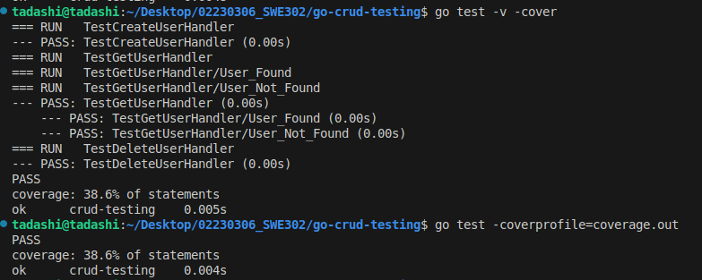
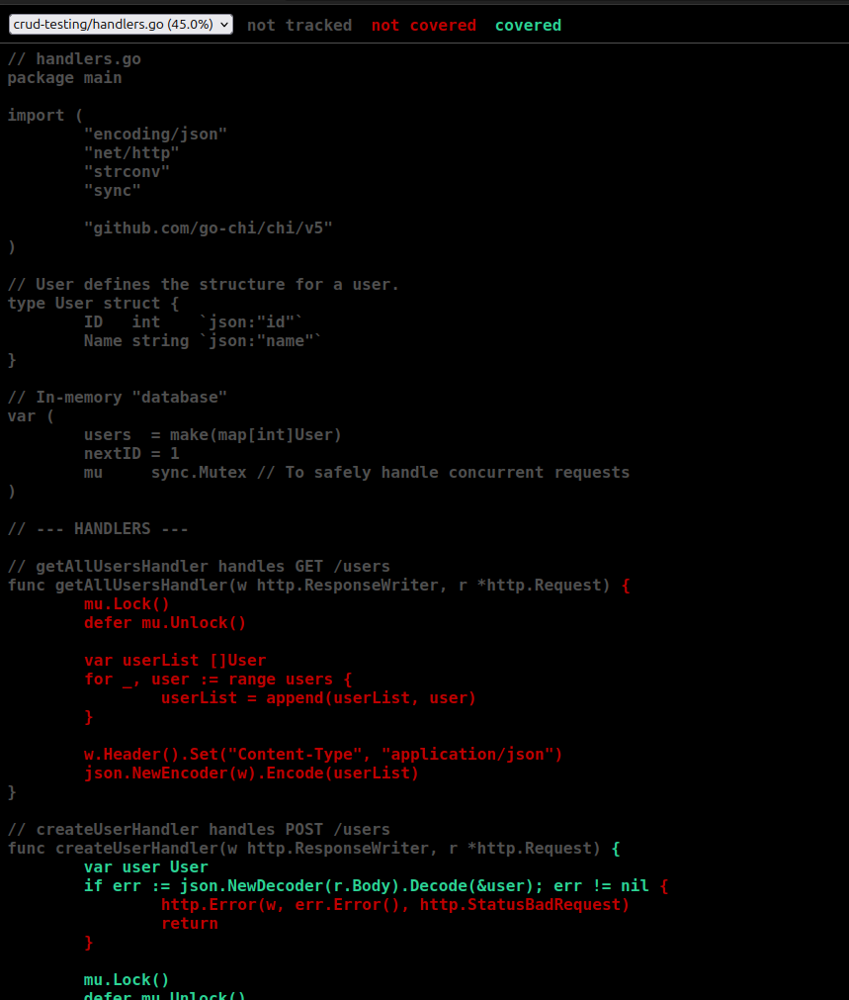

# Practical 2 Test Summary

### Test Execution Result 

The test result shows that all unit tests for the CRUD handlers passed successfully, indicating that the main functionality works as expected with code coverage of 38.6% at 0.005s. 

The handlers.go file shows 45% coverage, which indicates that while the basic functionality is tested, there are significant gaps in error handling and edge case testing. The red-highlighted sections in your code represent untested paths that should be addressed to improve the overall reliability of your CRUD application.

### Coverage Summary

Overall Coverage: 38.6% of statements

handlers.go Coverage: 45.0% 
